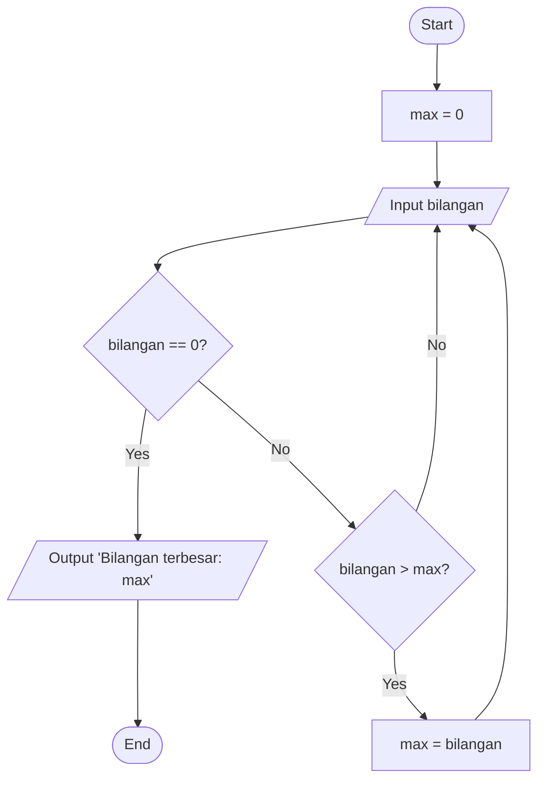

# 1.Mencari Bilangan Terbesar dari 3 Variabel
Program sederhana untuk menentukan bilangan terbesar dari tiga angka yang diinputkan pengguna.
 ## Deskripsi Program
 
Program ini akan:
1. Meminta user memasukkan 3 bilangan berbeda
2. Membandingkan ketiga bilangan tersebut
3. Menentukan bilangan mana yang terbesar
4. Menampilkan hasilnya ke layar
## Flowchart Program
````mermaid
flowchart TD
    A([Start]) --> B[/Input bilangan A,B,C/]
    B --> C{A>B?}
    C -->|Yes| D{A>C?}
    C -->|No| E{B>C?}
    D -->|Yes| F[A adalah terbesar]
    D -->|No| G[C adalah terbesar]
    E -->|Yes| H[B adalah terbesar]
    E -->|No| I[C adalah terbesar]
    F --> J[/Tampilkan Bilangan terbesar/]
    G --> J
    H --> J
    I --> J
    J --> K([End])
````
## Kode Program
```Python
a = int(input("Masukkan bilangan A: "))
b = int(input("Masukkan bilangan B: "))
c = int(input("Masukkan bilangan C: "))
if a > b:
    if a > c:
        print("Terbesar adalah A")
        terbesar = a
    else:
        print("Terbesar adalah c")
        terbesar = c
else:
    if b > c:
        print("Terbesar adalah B")
        terbesar = b
    else:
        print("Terbesar adalah C")
print(f"Bilangan terbesar adalah: {terbesar}")
```
## Untuk Contoh Output Program
````markdown
Masukkan bilangan A: 50
Masukkan bilangan B: 65
Masukkan bilangan C: 87
Terbesar adalah C
Bilangan terbesar adalah: 87
````
   
## Cara Kerja Program
Program bekerja dengan algoritma:
1. Menerima input 3 bilangan (A, B, C) dari user
2. Melakukan pengecekan dengan urutan:
   - Apakah A > B?
     - Jika ya: cek apakah A > C?
       - Jika ya: A adalah terbesar
       - Jika tidak: C adalah terbesar
     - Jika tidak: cek apakah B > C?
       - Jika ya: B adalah terbesar
       - Jika tidak: C adalah terbesar
3. Menampilkan bilangan terbesar yang ditemukan
# 2.Program Mencari Bilangan Terbesar Dari N Bilangan
Program sederhana untuk mencari nilai terbesar dari sekumpulan bilangan yang dimasukkan oleh pengguna menggunakan loop while True dan break statement.
## Deskripsi Program

Program ini akan:
- Menggunakan while True untuk perulangan tak terbatas
- Menggunakan while True untuk perulangan
- Menggunakan break statement untuk menghentikan program
- Membandingkan setiap input dengan nilai maksimum yang tersimpan
- Menampilkan bilangan terbesar yang ditemukan
## Flowchart Program

## Kode Program
```python
max = 0                                              
while True:                                          
    bilangan = int(input("Masukan bilangan(0 untuk berhenti): "))  
    if bilangan == 0:                               
        break                                       
    if bilangan > max:                     
        max = bilangan                     
print(f"Bilangan terbesar: {max}")
```
## Untuk Contoh Output Program:
````markdown
Masukan bilangan(0 untuk berhenti): 5
Masukan bilangan(0 untuk berhenti): 9
Masukan bilangan(0 untuk berhenti): 3
Masukan bilangan(0 untuk berhenti): 12
Masukan bilangan(0 untuk berhenti): 7
Masukan bilangan(0 untuk berhenti): 0
Bilangan terbesar: 12
````
## Cara Kerja Program
Program menginisialisasi variabel max dengan nilai 0
Program memulai loop tak terbatas dengan while True
Di dalam loop:
Program meminta user memasukkan bilangan
Jika user memasukkan 0, program akan keluar dari loop dengan break
Jika bilangan yang dimasukkan lebih besar dari nilai maximum saat ini, nilai maximum diperbarui
Setelah keluar dari loop, program menampilkan bilangan terbesar
